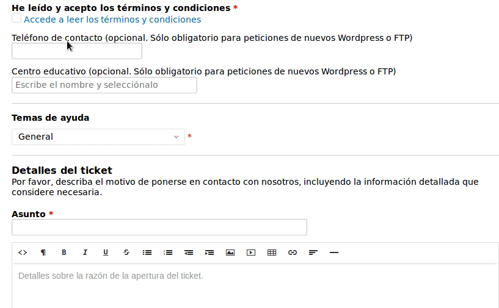

## Préstamos de material

Algunos cursos de Aularagón se pueden realizar con material prestado por CATEDU. Una vez se publica la lista de admitidos en cada convocatoria, aquellos participantes de los cursos con material en préstamo, pueden pasar a recogerlo **simplemente enseñando su DNI**.

### Lugar y horario de recogida

* **Centro de Profesorado María de Ávila**, junto a IES Virgen del Pilar.
* Paseo Reyes de Aragón, 20, 50012 Zaragoza
* 2ª planta.
* **Horario: 9:00 a 14:00**

    

        
    

    

        
    

### ¿Y si no puedo en ese horario?

[Envíanos un tiquet](http://soporte.catedu.es/open.php) **con al menos 24 horas de antelación** y dejaremos el material preparado en conserjería. **No olvides seleccionar como tema de ayuda _"Coger material fuera de horario"_**.

Para recogidas fuera de horario, la conserjería estará disponible:
* 14:00 a 20:30 de lunes a jueves.
* 14:00 a 18:30 los viernes.

### ¿Puede recogerlo otra persona por mí?

Por supuesto. [Descarga este documento](https://drive.google.com/file/d/1uVmkZDku-b0pfUEHZrZZvqgolZVDheVa/view?usp=sharing), rellénalo y dáselo a tu persona de confianza.
